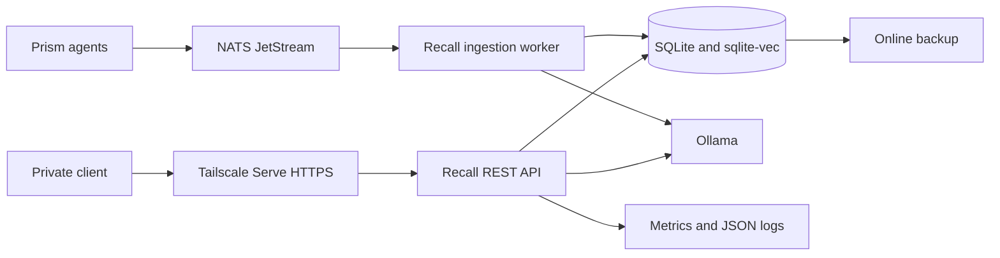

# Recall 2.1 architecture

## System boundary

Recall is a private, single-user, single-node service. Tailscale Serve is the remote HTTPS boundary; Recall, Ollama, and NATS bind to loopback on the host. Bearer authentication remains enabled behind Tailscale as defense in depth.

MCP normally uses a local stdio transport. REST is the externally proxied interface. NATS is an ingestion transport, not a read API.

## Capture flow

1. The raw input and one `capture.process` outbox job commit in the same SQLite transaction before model-dependent work begins.
2. A bounded dispatcher atomically claims due work with a lease. Process exits leave the job reclaimable; transient failures use bounded exponential retry.
3. The first gate result is persisted. Rejected inputs retain an audited raw row and return `SKIP`; accepted inputs use the same stable ID for an idempotently created memory.
4. Extraction updates summary, category, tier, and topics. Entity links/timeline events and conservative facts use stable derivation keys so retries do not duplicate derived state.
5. When enabled, Ollama creates an `embeddinggemma` vector. Recall stores the model, dimensions, SHA-256 content hash, status, and timestamp.
6. Processing returns within 15 seconds: `complete`, `pending`, or `failed`. Timed-out work continues durably; exhausted work becomes visible as a dead outbox job. Durable and API-visible failures retain only an exception class plus a generic message, never raw exception or capture text.

JetStream events add a database event reservation before capture. Recall acknowledges only after the raw capture and unique event status are committed. Invalid or exhausted events are published to the durable dead-letter subject.

## Retrieval flow

Keyword retrieval uses FTS5 with a LIKE fallback. Vector retrieval uses exact cosine similarity over stored float32 vectors, with optional sqlite-vec acceleration packaged for production. Balanced mode combines keyword and vector ranks with reciprocal-rank fusion, applies tier boosts, and adds graph results below the lowest direct-result score. Project and agent filters include exact-scope plus intentionally global memories.

## Storage ownership

The primary database owns raw captures, memories, entities, edges, aliases, structured facts, memory/entity links, dream logs, and ingestion event IDs. Every Recall connection enables foreign keys; cleanup triggers protect upgraded databases created before cascade rules existed.

Canonical schema ownership is centralized in five ordered migrations.
The schema ledger, migration DDL, and each version record are transactional;
concurrent startup serializes through SQLite locking. Optional FTS5 structures
remain rebuildable derived state. See [Schema migrations](schema-migrations.md).

SQLite runs in WAL mode with a five-second busy timeout. This design supports one Recall process. Multiple writers, high availability, PostgreSQL, and shared multi-user authorization are outside the 2.1 boundary.

## Failure behavior

- Ollama unavailable: raw data remains durable; extraction falls back and embedding status records failure.
- NATS unavailable: REST/MCP continue; readiness reports NATS unavailable when the subscriber is configured.
- FTS drift: readiness fails and reports `fts_ok=false`.
- Process crash during NATS work: an unacknowledged message is redelivered; stale processing reservations can be reclaimed.
- Process crash during capture processing: expired outbox leases are reclaimed without duplicating memory, graph, timeline, or fact state.
- Capture processing failure: sanitized failure metadata remains observable on the job, raw capture, provisional memory, worker health, and metrics without exposing captured content.
- Corrupt backup: restore refuses it after `PRAGMA integrity_check`.
- Missing authentication on a non-loopback bind: startup refuses to listen.

## Recovery

Use `recall-admin backup` for SQLite online backups and `recall-admin restore` on a stopped service. Restore drills must also reapply configuration/secrets, restore NATS JetStream snapshots when event replay is required, run integrity checks, start dependencies, and verify readiness.
